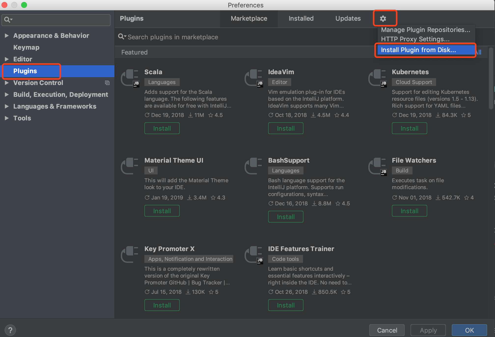

# PyCharm Plugin for Ontology

Adds support for Ontology Smart Contract Development:

1. Contract Compilation (.py)
2. Contract Deployment (TestNet / MainNet / PrivateNet)
3. Contract Invocation (Payed / PreExec)
4. Contract Debugging (Step through / Breakpoints / Variables Preview)

## Installation

1. Install Node.js, by using your favorite way such as [Official Installation Package](https://nodejs.org/en/) or [Node Version Manager](https://github.com/creationix/nvm) etc.

2. Install `Ontdev` via Command Line `npm install -g ontdev`

3. [Download](https://github.com/punicasuite/pycharm-plugin-for-ontology/releases) and install the plugin's jar file from disk.

   1. In the **Settings/Preferences** dialog OSX shortcut `⌘,` Windows shortcut `Ctrl+Alt+S`, select **Plugins**
  
   2. In the **Plugins** dialog, click  and then click **Install Plugin from Disk..**
   
      

4. when the project creating wizard appears, it will ask you where does the `ontdev` locate at. By default if ontdev is installed correctly, the path will be detected automatically otherwise you could find it out manually via `which ontdev` on *nix or `where.exe ontdev` on windows.
